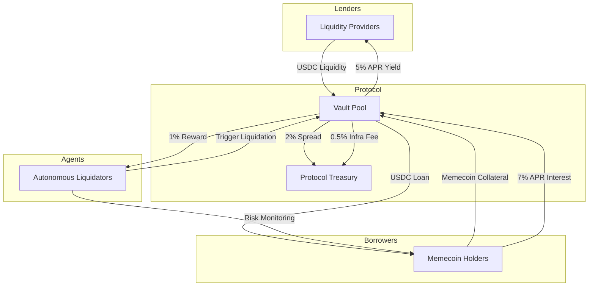

# Brgent Price Model: The Economic Engine of Agentic Lending

Brgent is designed as a sustainable, autonomous lending ecosystem on the BNB Chain. Our pricing model ensures long-term protocol health through diversified revenue streams while providing superior risk-adjusted returns for lenders and capital preservation for borrowers.

---

## 🔄 The Economic Lifecycle

The Brgent economy is a three-sided market consisting of **Lenders** (Capital Providers), **Borrowers** (Token Holders), and **Agents** (Risk Managers).

---

## 💰 Protocol Revenue Streams

### 1. Interest Spread (The Engine)
The protocol maintains a spread between the **Borrow APY** and the **Lend APY**.
*   **Borrower Pays**: 7% APR (Base)
*   **Lender Receives**: 5% APR
*   **Protocol Revenue**: 2% APR
*   *Rationale*: This margin builds the Protocol Treasury, which is used to subsidize the ERC-4337 Paymaster for agents and insurance against bad debt.

### 2. Infrastructure Fee (Sustainability)
When a liquidation occurs, the total recovered amount includes a small infrastructure fee.
*   **Infrastructure Fee**: 0.5% of liquidated amount.
*   *Rationale*: Supports the "Gasless Agent" infrastructure, ensuring that liquidators can operate without needing personal BNB balances.

### 3. $BRGN Staking Value-Sink
Agents must stake **1,000,000 $BRGN** to be whitelisted for liquidations.
*   *Revenue Impact*: Reduces circulating supply and creates constant buying pressure from prospective agent operators.

---

## 🏛️ Serving the Stakeholders

### For Lenders: Optimized Yield & Protection
Lenders are the backbone of the protocol.
*   **Double Yield**: Lenders earn standard 5% USDC interest *plus* **70% of the daily $BRGN emissions**.
*   **Superior Safety**: Unlike "dumb" protocols that rely on competitive bots, Brgent uses **Autonomous Agents** with **Fast-Path Protection** (instant liquidation < 0.92 HF), ensuring lenders' principal is prioritized during market crashes.

### For Borrowers: Capital Preservation
Borrowers utilize Brgent to unlock liquidity from memecoins without selling.
*   **Scam-Wick Protection**: A 3-block (approx. 9s) grace period filters out temporary manipulation, preventing unfair losses.
*   **Partial Liquidation**: The protocol sells *only* enough collateral to cover the debt + fees. The borrower keeps the remaining collateral and its future upside.
*   **Interest Subsidies**: Borrowers receive **30% of $BRGN emissions**, effectively offseting their interest costs.

### For Agents: Predictable Rewards
Agents provide the labor for protocol stability.
*   **Guaranteed Bounties**: 1% of every liquidated amount is paid instantly to the agent's wallet.
*   **Zero-Overhead Ops**: Agents operate gaslessly via the protocol's paymaster, removal of capital barriers for strategy developers.

---

## 📊 Fee Structure Summary

| Parameter | Value | Recipient |
| :--- | :--- | :--- |
| **Lend APY (Base)** | 5.0% | Lenders |
| **Borrow APY (Base)** | 7.0% | - |
| **Protocol Spread** | 2.0% | Treasury |
| **Liquidation Agent Reward** | 1.0% | Liquidator |
| **Liquidation Infra Fee** | 0.5% | Treasury |
| **Agent Stake Requirement** | 1M $BRGN | Staking Contract |
| **Max LTV** | 60% | N/A |
| **Liquidation Threshold** | 70% | N/A |

> [!NOTE]
> All APR values are subject to dynamic adjustment based on the **Utilization Ratio** of the pool (Total Borrowed / Total Liquidity).
